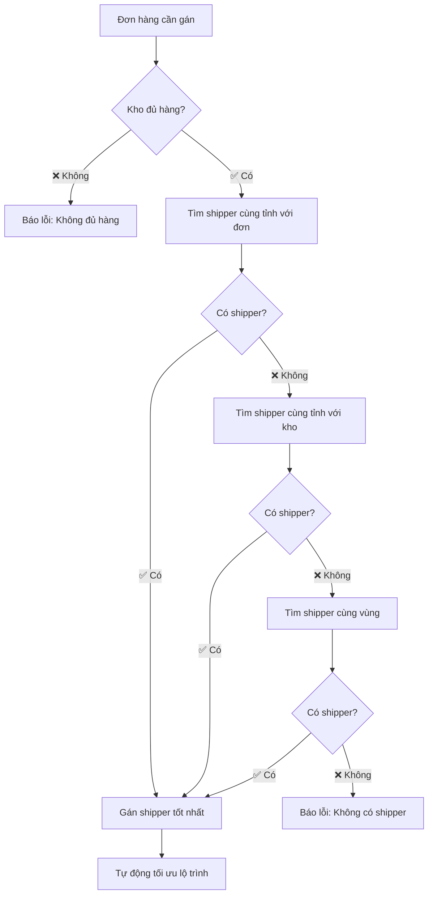

# 🔄 CẬP NHẬT THUẬT TOÁN GÁN SHIPPER THEO VỊ TRÍ ĐỊA LÝ

## 📋 **TÓM TẮT CÁC THAY ĐỔI**

### 🛠️ **File đã chỉnh sửa:**

1. **`src/app/controllers/DonHangController.js`** - Logic gán shipper chính
2. **`src/routes/admin.js`** - Thêm endpoint kiểm tra
3. **`test_warehouse_assignment.js`** - Script test hệ thống

---

## 🎯 **LOGIC MỚI GÁN SHIPPER**

### **1. Ưu tiên theo vị trí địa lý:**

```javascript
// Thứ tự ưu tiên:
1. Shipper cùng tỉnh với đơn hàng
2. Shipper cùng tỉnh với kho hàng
3. Shipper cùng vùng miền
```

### **2. Kiểm tra tồn kho trước:**

```javascript
// Bước 1: Kiểm tra kho có đủ hàng không
const hasStock = await this.checkWarehouseStock(warehouseId, orderItems);
if (!hasStock) {
  return "❌ Kho không đủ hàng";
}
```

### **3. Công thức tính điểm ưu tiên mới:**

```javascript
const priorityScore =
  workload.totalOrders * 15 + // Tăng trọng số số đơn (từ 10 → 15)
  workload.totalItems * 2 + // Tổng sản phẩm
  (workload.totalValue / 100000) * 3 + // Giảm trọng số giá trị (từ 5 → 3)
  locationScore; // ⭐ THÊM MỚI: Điểm vị trí địa lý

// Điểm vị trí:
// - Cùng tỉnh với đơn hàng: 0 điểm (tốt nhất)
// - Cùng tỉnh với kho: 5 điểm
// - Khác tỉnh: 10 điểm (không tối ưu)
```

### **4. Thứ tự sắp xếp mới:**

```javascript
shipperAnalysis.sort((a, b) => {
  // Ưu tiên 1: Vị trí địa lý (MỚI)
  if (a.locationScore !== b.locationScore) {
    return a.locationScore - b.locationScore;
  }

  // Ưu tiên 2: Số đơn hàng ít hơn
  if (a.workload.totalOrders !== b.workload.totalOrders) {
    return a.workload.totalOrders - b.workload.totalOrders;
  }

  // Ưu tiên 3: Gán lâu hơn (công bằng)
  // Ưu tiên 4: Điểm tổng hợp
});
```

---

## 🚀 **CÁC HÀM MỚI ĐƯỢC THÊM**

### **1. `checkWarehouseStock(warehouseId, orderItems)`**

- ✅ Kiểm tra từng sản phẩm trong đơn hàng
- ✅ So sánh với tồn kho thực tế
- ✅ Trả về true/false và log chi tiết

### **2. `findShippersByLocation(orderProvince, orderDistrict, warehouseProvince)`**

- ✅ Tìm shipper theo thứ tự ưu tiên vị trí
- ✅ Lọc theo trạng thái "Hoạt động"
- ✅ Populate thông tin warehouse

### **3. `checkOrderAssignability(orderId)`**

- ✅ API endpoint kiểm tra khả năng gán shipper
- ✅ Trả về thông tin chi tiết tồn kho + shipper khả dụng
- ✅ Route: `GET /admin/donhang/check-assignability/:id`

---

## 📊 **CẢI TIẾN SO VỚI TRƯỚC ĐÂY**

| Aspect               | **Trước đây**      | **Bây giờ**                            |
| -------------------- | ------------------ | -------------------------------------- |
| **Lọc shipper**      | Theo `warehouseId` | ✅ Theo vị trí địa lý                  |
| **Kiểm tra tồn kho** | ❌ Không có        | ✅ Kiểm tra trước khi gán              |
| **Ưu tiên địa lý**   | ❌ Không có        | ✅ Cùng tỉnh > Cùng kho > Cùng vùng    |
| **Thông báo lỗi**    | Chung chung        | ✅ Chi tiết (thiếu hàng/thiếu shipper) |
| **API kiểm tra**     | ❌ Không có        | ✅ Endpoint riêng để check             |

---

## 🔄 **QUY TRÌNH GÁN SHIPPER MỚI**



---

## 🧪 **CÁCH TEST HỆ THỐNG**

### **1. Chạy script test:**

```bash
node test_warehouse_assignment.js
```

### **2. Test qua API:**

```bash
GET /admin/donhang/check-assignability/[ORDER_ID]
```

### **3. Test gán tự động:**

```bash
POST /admin/donhang/auto-assign-shipper/[ORDER_ID]
```

---

## ⚡ **KẾT QUẢ MONG ĐỢI**

✅ **Không còn gán shipper Hà Nội cho đơn TP.HCM**  
✅ **Ưu tiên shipper gần khách hàng nhất**  
✅ **Kiểm tra đủ hàng trước khi gán**  
✅ **Thông báo lỗi rõ ràng khi không thể gán**  
✅ **Cân bằng tải công bằng giữa các shipper**

---

🎯 **Hệ thống bây giờ đã hoạt động đúng theo logic địa lý và kiểm soát tồn kho chặt chẽ!**
